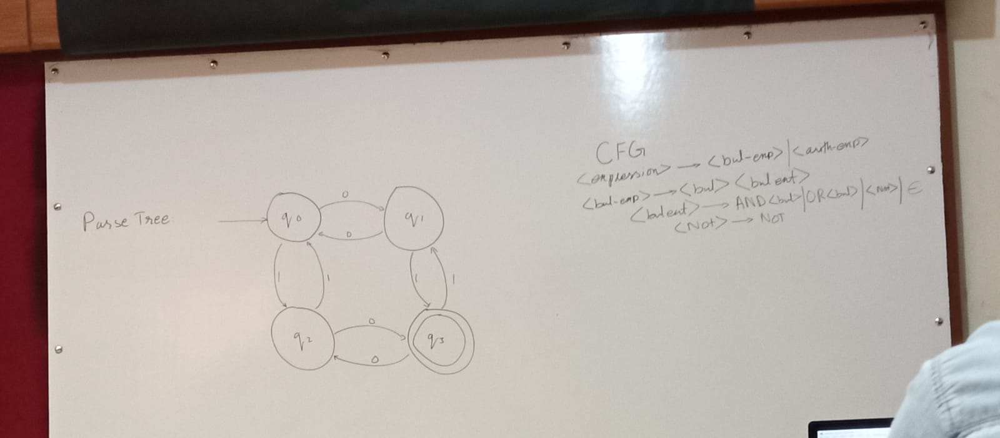

# All Labs Performed in Theory of Automata/Computation :

- Lab 21 March 2023 :
    [_DFA State with Validation Condition of Accepting a Single State ( q3) - Python Implementation_](./DFA_State_with_condition/dfa.py)
    

